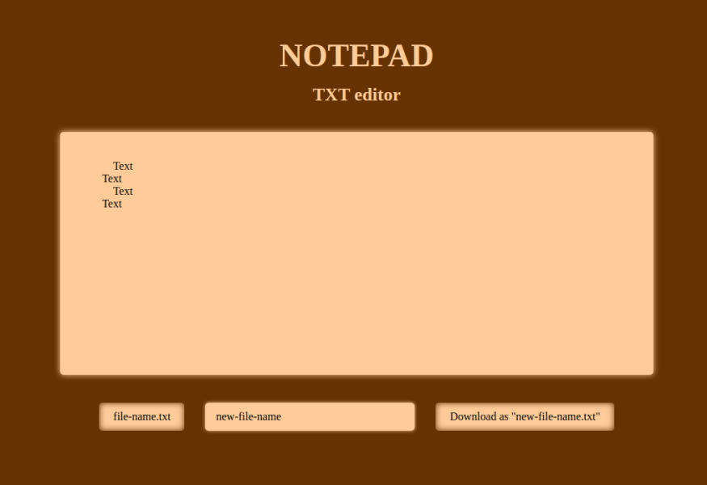

<h1 align="center">Notepad</h1>

---
Описание
---

Онлайн текстовый редактор. 

Приложение сохраняет текстовый файл в формате "txt".

Пользователь может написать  текст файла и указать название файла.

Пользователь может загрузить файл, отредактировать текст, название и сохранить. 

По умолчанию сохраняется пустой файл "text.txt"

Всё происходят в браузере пользователя. Никакие данные не отправляются.